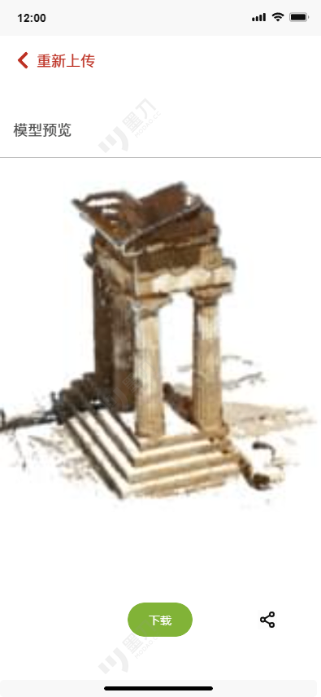
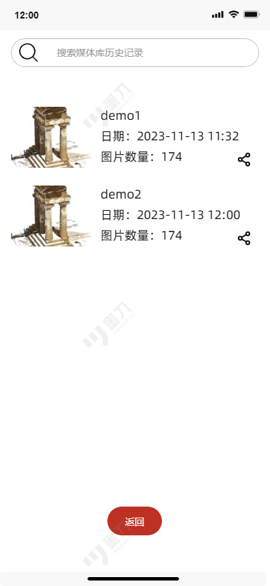
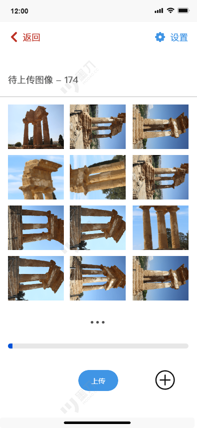
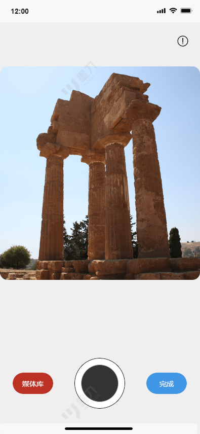
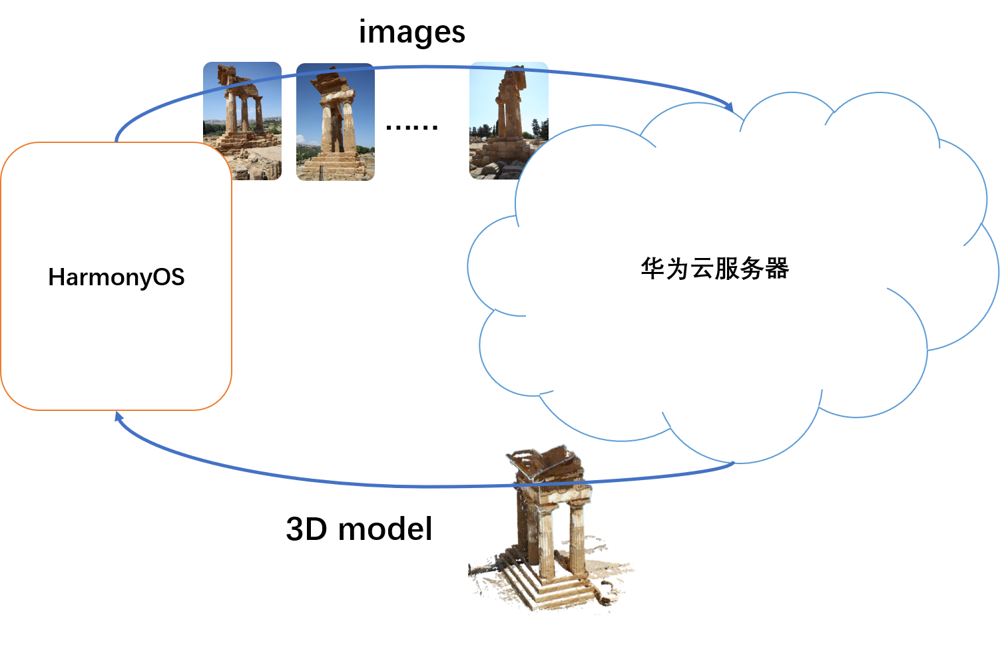
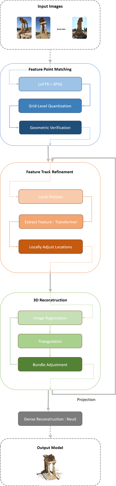

# ICT_client
2023-2024华为ICT大赛中国区总决赛二等奖作品。

HarmonyOS移动客户端前端部分。

DevEco Studio/ArkTS。

项目介绍：

本作品整体将采用客户-服务器模式，基于HarmonyOS、DevEco Studio、ModelArts、Mindspore和华为云等华为相关技术，实现一款基于NeRF的移动端3D重建软件。

软件介绍和演示视频：

<video src="README.assets/演示视频 剪辑版.mp4"></video>

初版软件原型图（与实际效果有出入）：

项目软件建构：

